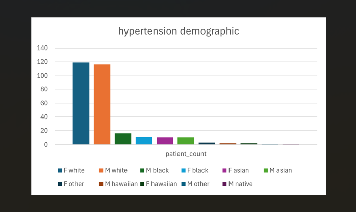

# SQL Analysis of Hypertension Management in Synthetic Clinical Data

## Project Overview
This project demonstrates the use of SQL to analyze synthetic clinical data generated by **Synthea™**.  
It focuses on identifying and exploring patients diagnosed with hypertension, their treatment, monitoring, and healthcare encounters.

## Objectives
- Identify patients diagnosed with hypertension  
- Analyze medication prescriptions among hypertensive patients  
- Track blood pressure monitoring frequency  
- Examine healthcare encounter patterns  
- Summarize demographic characteristics of hypertensive patients  

## Data Source
- **Dataset:** Synthea™ Synthetic Patient Data  
- **Format:** CSV files  
- **Main Tables:**  
  - `patients` (demographics)  
  - `conditions` (diagnoses)  
  - `medications` (prescriptions)  
  - `observations` (vitals and labs)  
  - `encounters` (visit details)  

## Tools & Environment
- PostgreSQL database  
- psql for querying  
- CSV exports for results  
- Excel(charts) for visualization  


## Analysis Highlights
- Cohort definition: identified hypertensive patients using condition descriptions containing the term "hypertension".
- Medication usage: summarized prescription rates of common antihypertensive medications (ACE inhibitors, beta blockers).
- Monitoring patterns: tracked the frequency of systolic and diastolic blood pressure observations over time.
- Encounter analysis: analyzed the number and type of healthcare encounters (outpatient, emergency) for hypertensive patients.
- Demographic summary: profiled hypertensive patients by age group, gender, and race.


## Hypertension analysis Charts 
- These charts provide a demographic summary and an overview of medications prescribed for hypertension.




### Cohort Definition
- This cohort includes all unique patients who have a recorded condition where the description text contains the word "hypertension".
```sql
CREATE TEMP TABLE hypertensive_patients AS
SELECT DISTINCT "PATIENT"
FROM conditions
WHERE LOWER("DESCRIPTION") LIKE '%hypertension%';

